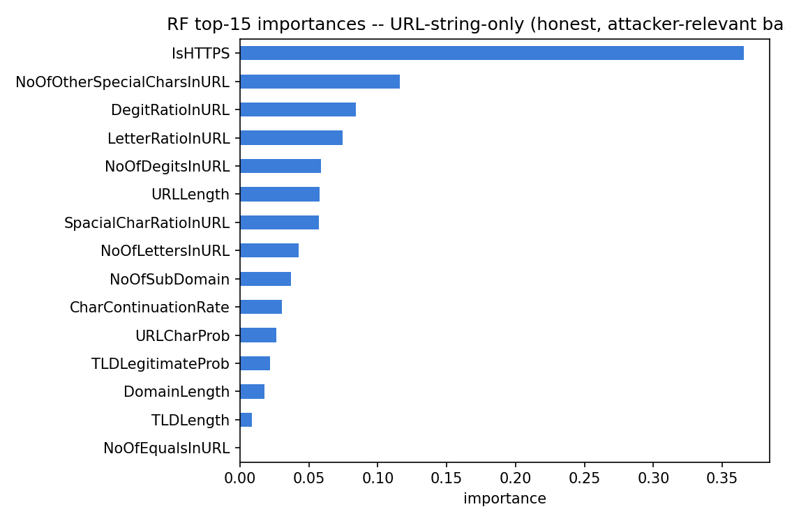
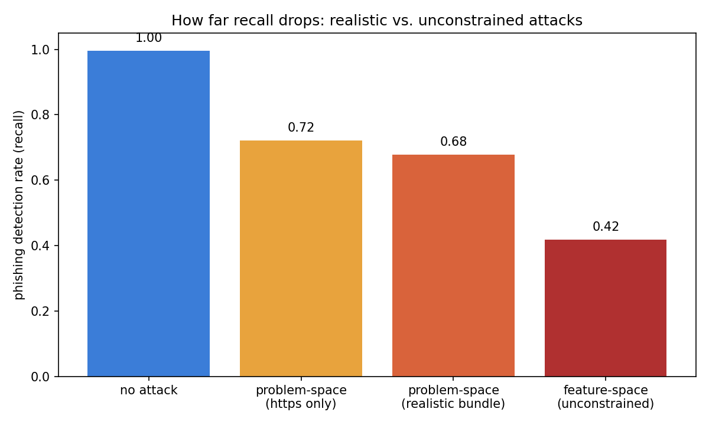
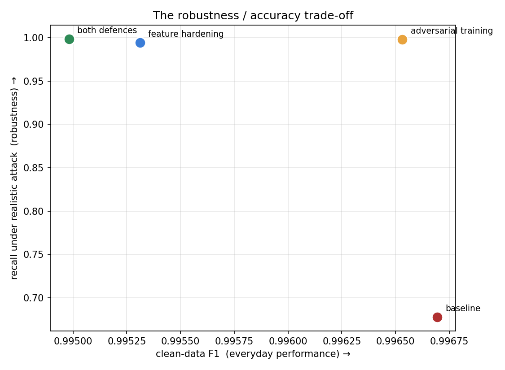

# Phishing URL Detection — Baseline, Leakage Analysis & Adversarial Robustness

A machine-learning project that detects phishing URLs — and, more importantly,
interrogates *why* it works, where it fails, and how easily it can be fooled.

> **Status:** Complete. Baseline, leakage analysis, failure-mode study, an
> adversarial attack, and two defences are all implemented and reproducible.

---

## TL;DR

- Trained a logistic regression and a random forest on the **PhiUSIIL** dataset
  (235,795 URLs) to classify phishing vs. legitimate.
- Both models scored **~100%** — a **red flag, not a win**. The dataset is
  trivially separable because of **data leakage**: phishing pages were crawled
  nearly empty, and `URLSimilarityIndex` separates the classes almost perfectly
  on its own (AUC **0.996**).
- Rebuilt an **honest, URL-only baseline** from features an attacker actually
  controls: **F1 0.997, ROC-AUC 0.999**.
- **Attacked it.** A single free move — serving phishing over HTTPS — drops
  recall from **0.995 to 0.72**. An unconstrained *feature-space* attack looks
  nearly twice as devastating (58% evasion), but ~half of that is **unrealisable**;
  the realistic *problem-space* number is 32%.
- **Defended it.** Feature hardening and adversarial training both restore
  recall-under-attack to **~0.99**, at a clean-data cost of **under 0.15% F1** —
  revealing the baseline leaned on `IsHTTPS` out of laziness, not necessity.

---

## Why this project is about *honesty*, not leaderboard scores

A phishing detector that reports 99% accuracy sounds great until you realise the
data is imbalanced and the number is hollow. This project is built around four
ideas that matter more than a high score:

1. **The base-rate problem** — why accuracy is the wrong metric here.
2. **Data leakage** — why a "perfect" model can be learning the wrong thing.
3. **Explainable failure** — being able to say *why* the model makes its mistakes.
4. **Adversarial robustness** — whether the model survives an attacker who edits
   the URL, and the difference between *apparent* and *realisable* evasion.

### 1. Why not accuracy?

The data is ~43% phishing, ~57% legitimate. A lazy model that *always* predicts
"legitimate" scores **57% accuracy while catching zero phishing** (recall = 0).
Accuracy just rewards guessing the majority class, so it can hide a useless
model. I report **precision, recall, F1, and ROC-AUC** instead, with phishing as
the positive class. (The effect is mild here but explodes on real traffic, where
phishing can be well under 1% of URLs.)

### 2. The leakage finding

Ranking each feature by how well it separates the classes *on its own*
(single-feature ROC-AUC, where 1.00 = a perfect giveaway):

| feature | solo AUC |
|---|---|
| URLSimilarityIndex | 0.996 |
| LineOfCode | 0.990 |
| NoOfExternalRef | 0.988 |
| NoOfImage | 0.980 |
| NoOfJS | 0.971 |
| NoOfCSS | 0.958 |

Note `URLSimilarityIndex`: its linear *correlation* with the label is only 0.86,
so a correlation check waves it through — but its AUC is 0.996. **Single-feature
AUC is the right tool for spotting leakage.**

The page-content features are near-perfect separators because the phishing pages
were captured nearly empty:

| feature | mean (legit) | mean (phishing) | % of phishing rows = 0 |
|---|---|---|---|
| LineOfCode | 1947 | 66 | — |
| NoOfImage | 45 | 0.9 | 83% |
| NoOfJS | 18 | 0.9 | 77% |
| HasSocialNet | 0.79 | 0.01 | 99% |

So the model wasn't learning *"is this URL phishing"* — it was learning *"did the
crawler find a real web page."* That's an artifact of how the data was collected,
and it's leakage relative to the real task.

**Decision:** the honest baseline uses **URL-string-only features** — the part an
attacker actually controls — and excludes the leaky page-content signals.

---

## Baseline results

Best model (random forest) on the held-out test set:

| baseline | precision | recall | F1 | ROC-AUC |
|---|---|---|---|---|
| All 50 features *(leaky)* | 1.000 | 1.000 | 1.000 | 1.000 |
| URL-string only *(honest)* | 0.998 | 0.995 | 0.997 | 0.999 |

The leaky baseline's perfect score is the trap; the URL-only row is the result I
actually trust.



`IsHTTPS` alone carries **~37%** of the model's weight — a warning, since modern
phishing routinely uses HTTPS (free certificates) and `IsHTTPS` is trivial to
flip. That makes it the prime target for the attack below.

---

## 3. Where the model fails (and why)

On the test set the URL-only model misses **67 phishing URLs** (0.44%) and raises
**31 false alarms** (0.15%). The mistakes are not random:

| feature (mean) | missed phishing | caught phishing |
|---|---|---|
| IsHTTPS | **1.00** | 0.49 |
| URLLength | 28 | 46 |
| NoOfOtherSpecialCharsInURL | 1.5 | 3.9 |

Every phishing URL that slips through is **HTTPS, short, and tidy** — e.g.
`https://www.jp-metamask.org`, `https://www.notepad-install.top` — and the model
is *confident* they're safe (mean phishing-probability 0.11). The false alarms
are the mirror image: legitimate sites that look "messy" — hyphens, years,
numbers (`commonfuture-paris2015.org`, `study-in-egypt.gov.eg`) — sitting just
over the decision line.

**The model learned to detect *messiness*, not *malice*.** That single sentence
predicts exactly how to attack it.

---

## 4. Attacking the model: feature-space vs. problem-space

I take the phishing the model catches and try to disguise it two ways.

- **Feature-space (unconstrained):** edit the feature *vector* directly toward
  legit-looking values. Easy, and it can build **impossible** URLs — a length
  that no longer matches the characters it supposedly contains.
- **Problem-space (realistic):** edit the actual URL *string*, then recompute the
  features it changes, so they move together the way a real URL forces them to.
  Features an attacker can't cheaply fake are held fixed, making this a
  **conservative lower bound** on real evasion.



| attack | recall | evasion |
|---|---|---|
| no attack | 0.995 | 0.5% |
| problem-space — **HTTPS only** | 0.722 | **27.8%** |
| problem-space — realistic bundle | 0.678 | 32.2% |
| feature-space — unconstrained | 0.418 | 58.2% |

**Two findings.** (1) A single *free* move — switching to HTTPS — makes the
detector miss **more than one in four** phishing URLs (4,777 of them flip from
caught to evading). (2) The unconstrained feature-space attack overstates
evasion by roughly **2×**: enforcing that features move like a real URL removes
~26 points of "success" that could never actually happen. That gap between
*apparent* and *realisable* evasion is the core result of the project.
*(Reference: Pierazzi et al. 2020.)*

---

## 5. Defending it, and what the defence costs

| configuration | clean P | clean R | clean F1 | recall under attack |
|---|---|---|---|---|
| baseline (undefended) | 0.9980 | 0.9954 | 0.9967 | **0.678** |
| adversarial training | 0.9972 | 0.9958 | 0.9965 | **0.998** |
| feature hardening (drop `IsHTTPS`) | 0.9952 | 0.9954 | 0.9953 | **0.995** |
| both | 0.9949 | 0.9950 | 0.9950 | **0.999** |



Both defences lift recall-under-attack from 0.68 to ~0.99. The striking part is
the **cost**: dropping `IsHTTPS` — 37% of the model's importance — costs only
**0.14% of F1**. The baseline's reliance on HTTPS was *lazy, not necessary*; the
other 20 URL features carry enough redundant signal that removing the crutch
barely hurts.

**Honest caveat:** the adversarial-training figure (0.998) is optimistic — the
test attack uses the *same* transformation it trained on, so it is defending a
threat model it has already seen. **Feature hardening is the more trustworthy
defence:** it structurally removes the lever, so *any* HTTPS-based variant is
neutralised, not just the one demonstrated here.

---

## How to run

Requires **Python 3.13**. From the project folder:

```bash
# Windows (PowerShell) — one-time setup
python -m venv .venv
.\.venv\Scripts\python.exe -m pip install -r requirements.txt

# macOS / Linux — one-time setup
python3 -m venv .venv
./.venv/bin/python -m pip install -r requirements.txt
```

Each script is self-contained (it rebuilds the same seeded split) and prints its
report plus PNGs. Run them with the venv's Python, e.g.
`.\.venv\Scripts\python.exe attack.py`:

| script | produces |
|---|---|
| `phishing_baseline.py` | Both baselines, leakage check, metrics, feature importances |
| `diagnose.py` | The leakage-evidence tables |
| `failure_analysis.py` | Misclassified URLs + failure-mode stats |
| `attack.py` | The evasion attack, `attack_recall.png`, example disguised URLs |
| `defend.py` | The two defences, `defence_tradeoff.png`, results table |

---

## Roadmap

- [x] Baseline detector (logistic regression + random forest)
- [x] Imbalance-aware metrics + base-rate reasoning
- [x] Leakage detection and honest URL-only baseline
- [x] Failure-mode analysis (why the model makes its mistakes)
- [x] Adversarial attack — feature-space vs. problem-space evasion
- [x] Defences — adversarial training + feature hardening, with the trade-off

## Limitations

- **The adversarial-training result is optimistic** — it is tested against the
  same perturbation it trained on. A held-out attack variant (e.g. HTTPS + a
  plausible new subdomain) would likely bypass it while hardening holds.
- The problem-space attack holds fixed the features it can't faithfully recompute
  (e.g. `TLDLegitimateProb`), so real evasion is likely **worse** than reported.
- The dataset's collection bias (empty phishing pages; a near-perfect `IsHTTPS`
  split) means even the URL-only baseline is optimistic vs. real traffic.
- Only two model families; feature importances use impurity-based MDI, which is
  biased toward high-cardinality features (permutation importance would be firmer).

## Background reading

*(Read these before citing — don't cite what you haven't read.)*

- Pierazzi et al., *Intriguing Properties of Adversarial ML Attacks in the
  Problem Space* (2020) — the feature-space vs. problem-space distinction.
- Goodfellow et al., *Explaining and Harnessing Adversarial Examples* (2014) — FGSM.
- Szegedy et al., *Intriguing Properties of Neural Networks* (2013) — origin of
  adversarial examples.

## Repo contents

| File | Purpose |
|---|---|
| `phishing_baseline.py` | End-to-end pipeline: load → leakage check → train → evaluate → importances |
| `diagnose.py` | Standalone leakage-evidence script |
| `failure_analysis.py` | Failure-mode analysis of the URL-only model |
| `attack.py` | Feature-space vs. problem-space evasion attack |
| `defend.py` | Adversarial training + feature hardening, and the trade-off |
| `requirements.txt` | Pinned dependencies (Python 3.13 wheels) |
| `*.png`, `*.csv` | Generated plots, confusion matrices, and evidence tables |
