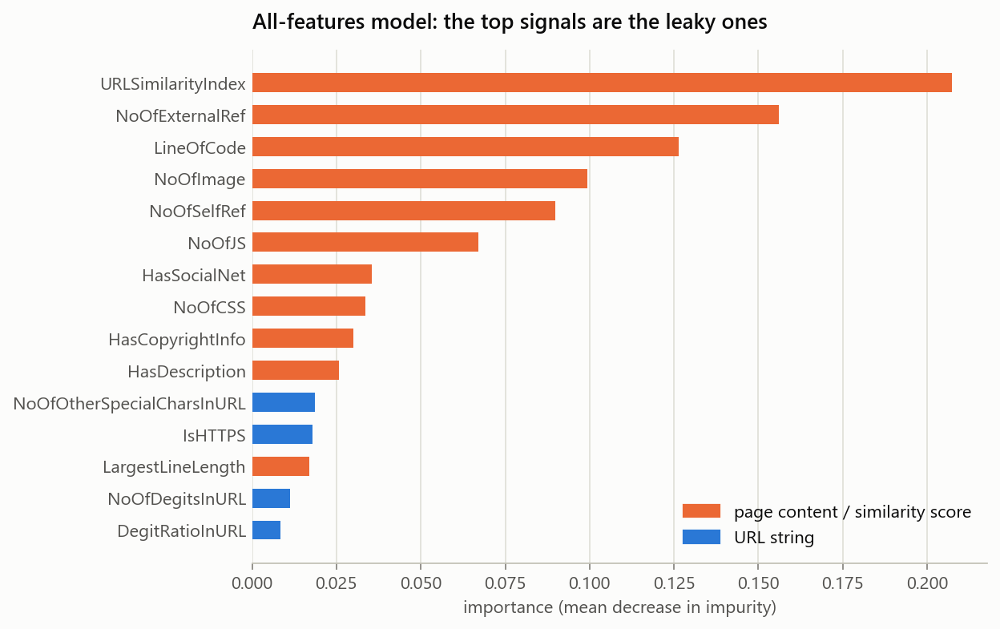
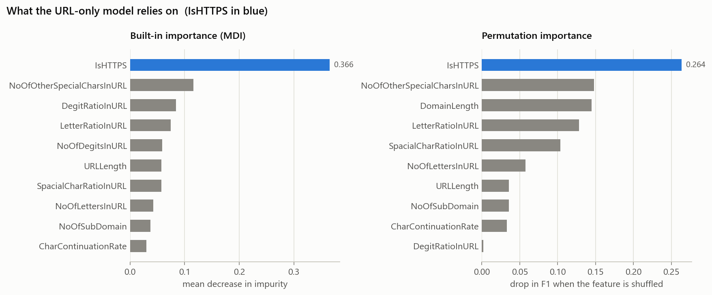
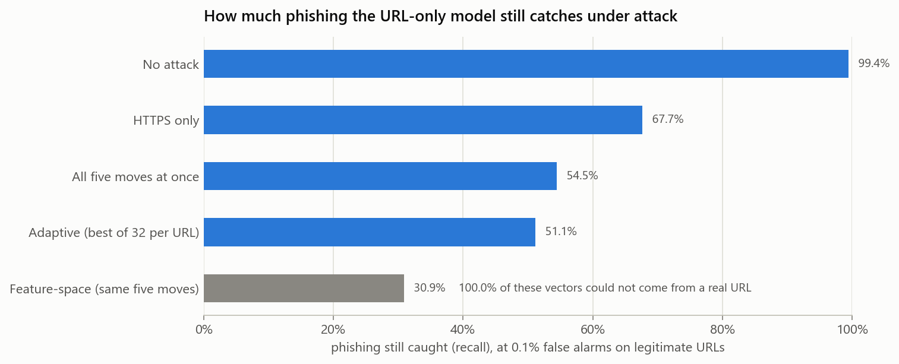
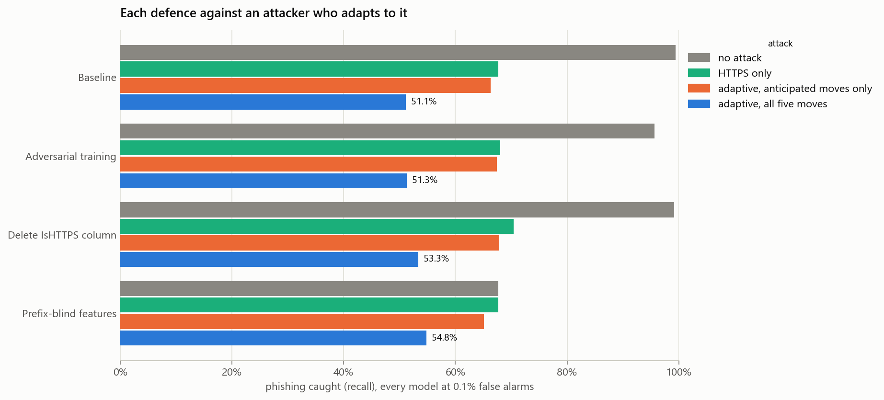

# Phishing URL detection, and how easily it gets fooled

This is a machine learning project where I built a model to tell phishing URLs
apart from normal ones, and then tried to break it. My first model scored almost
perfectly, and most of this project ended up being about why that score couldn't
be trusted and what happens when someone actually tries to get past it.

Everything here can be rerun with one command (`run_all.py`), which takes a few
minutes.

## The short version

- The dataset I used (PhiUSIIL, about 236,000 URLs) basically gives away the
  answer. A model using all of its features gets 100%. One feature,
  `URLSimilarityIndex`, is exactly 100 for every single legitimate URL, so just
  checking "is it 100?" catches 99.2% of phishing with no false alarms.
- So I only used features that come from the URL itself. That model still got an
  F1 score of 0.997, but it leans heavily on whether the URL uses HTTPS, and every
  legitimate URL in the dataset happens to start with `https://www.`.
- Then I attacked it with changes a real attacker could actually make to a URL,
  like switching to HTTPS or adding `www.`. Switching to HTTPS alone dropped the
  share of phishing it caught from 99.4% to 67.7%. When the attacker could try
  every combination of five changes, about half of all phishing got past it.
- I tried three defences and none of them really fixed it. The one that stops the
  free tricks from working also drops the model to catching 67.7% of normal
  phishing, which shows most of its original score came from the `https://www.`
  pattern.

## Data

I used the PhiUSIIL Phishing URL dataset from the UCI repository (id 967). It has
134,850 legitimate URLs and 100,945 phishing URLs, so about 43% phishing. I
relabelled it so phishing is 1, since that's the thing I'm trying to catch. I
split it 70/15/15 into training, validation and test sets (with the same share of
phishing in each), made all my decisions using the validation set, and only used
the test set for the final numbers.

I don't use accuracy as the main metric. A model that just says "legitimate"
every time would get 57% accuracy here while catching no phishing at all, and in
real web traffic, where phishing is way under 1% of URLs, that problem gets much
worse. So I report precision (how many of the URLs it flags are really phishing),
recall (how much of the phishing it catches), F1 (a balance of the two) and
ROC-AUC (how well it ranks phishing above legitimate URLs overall).

## 1. The data gives away the answer

The first thing I did was check how well each feature separates phishing from
legitimate URLs on its own. A few of them were way too good:

| feature | AUC on its own |
|---|---|
| URLSimilarityIndex | 0.996 |
| LineOfCode | 0.990 |
| NoOfExternalRef | 0.988 |
| NoOfImage | 0.980 |
| NoOfJS | 0.971 |

An AUC of 1.0 would mean that one feature separates them perfectly. Also,
`URLSimilarityIndex` only has a correlation of 0.86 with the label, so if I had
only checked correlation I would have missed it.

When I looked closer I found four problems with how the data was collected:

- Every one of the 134,850 legitimate URLs has a `URLSimilarityIndex` of exactly
  100, but only 0.78% of phishing URLs do. A one-line rule ("if it's not 100,
  it's phishing") is right 99.67% of the time.
- The phishing pages were mostly captured empty, so the page content features
  really just say whether the crawler found a real page:

  | feature | average (legitimate) | average (phishing) | phishing pages at 0 |
  |---|---|---|---|
  | LineOfCode | 1,947 | 66 | - |
  | NoOfImage | 45 | 0.9 | 83% |
  | NoOfJS | 18 | 0.9 | 77% |
  | HasSocialNet | 0.79 | 0.01 | 99% |

- The two classes weren't even processed the same way. For every legitimate URL
  the last character was cut off before the features were calculated, but this
  only happened to 52% of the phishing URLs. It looks like a small bug in the
  original code.
- Every legitimate URL starts with `https://www.`, while only 48.7% of phishing
  URLs use HTTPS and 41.4% have `www.`. This one is easy to miss, and it ended up
  mattering a lot later on.



Because of all this, I decided to only use the 21 features that are worked out
from the URL text itself, since that's the part an attacker actually controls.
None of these give the answer away on their own (the best one has an AUC of
0.82).

## 2. Baselines

I trained a logistic regression and a random forest, picked the better one on the
validation set (the random forest both times), and then tested it once:

| features used | precision | recall | F1 | ROC-AUC |
|---|---|---|---|---|
| all 50 (leaky) | 1.000 | 1.000 | 1.000 | 1.000 |
| 21 URL features | 0.998 | 0.995 | 0.997 | 0.999 |



The most important feature by far is `IsHTTPS`. It makes up 37% of the random
forest's built-in importance, and shuffling it hurts the model more than
shuffling anything else. I checked it both ways because the built-in importance
can be biased, and the attack later on depends on knowing what the model really
uses.

## 3. Where the model gets it wrong

On the test set the URL-only model misses 70 phishing URLs (0.46%) and wrongly
flags 30 legitimate ones (0.15%). The mistakes have a really clear pattern:

| | phishing it missed | phishing it caught | legitimate sites it flagged |
|---|---|---|---|
| uses `https://` | 100% | 49% | 100% |
| has `www.` | 100% | 41% | 100% |
| average URL length | 28 | 46 | 30 |
| average symbols (`-`, `.` etc.) | 1.5 | 3.9 | 1.7 |

Every phishing URL it missed looks like `https://www.something`, for example
`https://www.jp-metamask.org` and `https://www.notepad-install.top`. That's
exactly how every legitimate URL in the dataset looks, and the model was
confident these were safe (an average phishing probability of 0.13). The
legitimate sites it flagged were borderline calls (around 0.62) that just look a
bit messy, like `commonfuture-paris2015.org` or `study-in-egypt.gov.eg`. So the
model learned what phishing URLs usually look like. It didn't learn what makes
them dangerous, and that also tells you how to attack it.

## 4. Attacking my own model

I wanted to see how the model holds up against someone actually trying to get
phishing past it. There are two kinds of attack you can test with:

- A feature-space attack just changes the numbers that go into the model. It's
  easy, but the result might not match any URL that could actually exist.
- A problem-space attack changes the real URL and then recalculates the features
  from it. It's harder, but it's what an attacker can really do.

To do the second kind properly I needed to recalculate the features exactly the
way the dataset did. That isn't documented anywhere, so I worked the rules out
from the data. For example, the character counts ignore `http://` or `https://`
and `www.`. 19 of the 21 features match the dataset's own values on at least
98.6% of all 235,795 URLs, and 6 of them match on every single URL.
`URLCharProb` I could only approximate (correlation 0.985), and `URLLength` comes
from each URL's own length.

The attacker can make five changes:

1. serve the page over HTTPS (certificates are free)
2. add `www.` (it's just a subdomain of their own domain)
3. use a domain name without numbers or hyphens
4. register the domain as `.com`
5. put the phishing page at the root of the site, with no path or query string

But they can only change domains they actually own. About half the phishing URLs
(50.2%) are on someone else's domain, like a hosting platform (`web.app`,
`firebaseapp.com`), an IPFS gateway or link shortener (`ipfs.io`, `bit.ly`), a
hacked website, or just an IP address. For those, the only change I allow is
switching to HTTPS.

I also set the model's threshold so it only flags 1 in 1,000 legitimate URLs
(0.1%), chosen on the validation set, which is closer to how a real filter would
be set up. The strongest attacker tries all 32 combinations of the five changes
on each URL and keeps whichever one the model trusts most, like someone testing
different versions against a filter before sending them out.

Here are the results on all 15,142 phishing URLs in the test set (accurate to
within about 0.8 percentage points):

| attack | phishing still caught | got past the model |
|---|---|---|
| no attack | 99.4% | 0.6% |
| HTTPS only | 67.7% | 32.3% |
| all five changes at once | 54.5% | 45.5% |
| best of 32 combinations per URL | 51.1% | 48.9% |
| feature-space (same five changes) | 30.9% | 69.1% |



Switching to HTTPS does most of the damage on its own. It was used in 79% of the
successful attacks (adding `www.` was used in 27%), and 7,313 URLs went from
caught to missed. For example, the model gave `http://www.pradopro.ru` a phishing
score of 1.00, but gave `https://www.pradopro.ru` a score of 0.00.

The feature-space attack looks a lot scarier, with 69% getting past the model
compared to 49% for the real attack. But every single one of those feature-space
"URLs" breaks at least one rule that real URLs always follow, like having zero
symbols while the domain still has dots in it. None of the real attack's URLs
break any of those rules. So that 69% is describing URLs that couldn't exist,
and the 20 point gap is the feature-space vs problem-space difference described
by Pierazzi et al. (2020).

## 5. Trying to defend it

To make the comparison fair, every model is set to the same false alarm rate of
1 in 1,000, and the attacker gets to try all 32 combinations against each
defended model separately. Adversarial training only gets to see two of the five
changes (HTTPS and the cleaner domain name), so I could test whether it learns
anything more general.

| model | no attack | HTTPS only | attack with only HTTPS + cleaner name | attack with all 5 changes | change in normal recall |
|---|---|---|---|---|---|
| original model | 99.4% | 67.7% | 66.3% | 51.1% | - |
| adversarial training | 95.7% | 68.0% | 67.5% | 51.3% | -3.8 points |
| delete the IsHTTPS column | 99.2% | 70.4% | 67.9% | 53.3% | -0.3 points |
| prefix-blind features | 67.7% | 67.7% | 65.1% | 54.8% | -31.8 points |



### Deleting the IsHTTPS column

This doesn't work. The dataset counts characters after `https://` but measures
`URLLength` including it, so `URLLength` minus the counted characters is exactly
7, 8, 11 or 12 (the lengths of `http://`, `https://`, `http://www.` and
`https://www.`) for 99.8% of URLs. You can get HTTPS back from that difference
for 99.7% of URLs, so the model can still tell even without the column.

### Adversarial training

This doesn't really help either. Training on disguised phishing made the model
suspicious of exactly the kind of URLs legitimate sites use, so to keep false
alarms at 1 in 1,000 its threshold had to go up from 0.62 to 0.98. In the end it
catches 3.8 points less normal phishing and only 0.2 points more under attack.
If you use the default threshold of 0.5 instead, it looks great (74.4% caught
under attack), but only because it flags 9.7% of legitimate sites, which is 65
times more than the original model. That's why I compare everything at the same
false alarm rate.

### Prefix-blind features

These drop `IsHTTPS` and measure every length and ratio without the
`http(s)://www.` part, so switching to HTTPS or adding `www.` doesn't change
anything anymore (the attacker used those two changes in 0% of its successful
attempts). The problem is that the model now only catches 67.7% of normal
phishing instead of 99.4%, and its ROC-AUC drops from 0.999 to 0.933. I think
this is the most realistic picture of what these URL features can actually do,
and it means most of the original model's score came from the `https://www.`
pattern. Even with this defence, an attacker who's willing to register a cleaner
name or a `.com` still gets 45% of phishing through.

## What I got wrong the first time

My first version of this project came to the opposite conclusion, that both
defences brought the model back up to about 99% under attack for almost no cost.
That was wrong, for two reasons:

1. My attack calculated the features differently from the dataset. It counted
   characters over the whole URL, while the dataset skips `http(s)://` and
   `www.`. Because of that, switching to HTTPS changed `URLLength` and the letter
   count together, which hid the fact that `URLLength` gives away HTTPS. It also
   made some URLs that couldn't exist (an IP address with its numbers removed
   turned into `https://.../`), and it "moved" phishing hosted on sites like
   `web.app` or `ipfs.io` to domains the attacker could never own.
2. I compared the defences at the default 0.5 threshold, where adversarial
   training looks good just because it flags way more legitimate sites.

Once I checked the feature rules against every URL in the dataset, limited the
attacker to changes they could really make, and fixed the false alarm rate, the
conclusion flipped. The biggest thing I learned from this project is that an
evaluation is only as good as the attack you test it with.

## Running it yourself

You'll need Python 3.13, because the pinned package versions have ready-made
installs for it. From the project folder:

```bash
# set up (Windows, PowerShell)
python -m venv .venv
.\.venv\Scripts\python.exe -m pip install -r requirements.txt

# set up (macOS / Linux)
python3 -m venv .venv
./.venv/bin/python -m pip install -r requirements.txt

# rerun everything (a few minutes)
.\.venv\Scripts\python.exe run_all.py          # or ./.venv/bin/python run_all.py

# run the tests
.\.venv\Scripts\python.exe -m unittest discover -s tests -v
```

The dataset downloads from UCI the first time and gets saved in `data/`. You can
also run each part on its own:

| script | what it does |
|---|---|
| `diagnose.py` | checks the data for leakage (section 1) |
| `phishing_baseline.py` | trains both baselines and makes the importance charts |
| `failure_analysis.py` | looks at the URLs the model gets wrong |
| `attack.py` | runs the problem-space and feature-space attacks |
| `defend.py` | tests the three defences against the attacker |
| `common.py` | shared code, including the feature recalculation |

Every chart in `figures/` has its numbers saved as a CSV in `results/`.

## Limitations and what I'd do next

- The legitimate URLs aren't realistic. They're all homepages written as
  `https://www.domain`, so any model trained on this data learns that "looks like
  a homepage" means safe. The most useful next step would be to rebuild the
  legitimate side with real-looking URLs (links to inner pages, sites without
  `www.`) and run everything again.
- Parts of the attack are approximations. `URLCharProb` is estimated, and I guess
  which domains are shared by counting how many URLs use them. That probably
  counts a few heavily reused attacker domains as shared, which makes the attack
  a bit cautious. I also assume a cleaner name or a `.com` is available to
  register.
- URL features only show a small part of the picture. Real filters also use
  things that are expensive to fake, like how old a domain is or its certificate
  history. Adding those and rerunning the attack would be the next defence to
  try.
- I only used one dataset, one type of model for the attacks and defences, one
  random seed, and one round of adversarial training.

## Data and related reading

The dataset is the PhiUSIIL Phishing URL dataset from the UCI Machine Learning
Repository (id 967),
https://archive.ics.uci.edu/dataset/967/phiusiil+phishing+url+dataset. It comes
from A. Prasad and S. Chandra, "PhiUSIIL: A diverse security profile empowered
phishing URL detection framework based on similarity index and incremental
learning", Computers & Security (2024),
https://doi.org/10.1016/j.cose.2023.103545.

Related reading:

- Pierazzi et al., *Intriguing Properties of Adversarial ML Attacks in the
  Problem Space* (2020), on feature-space vs problem-space attacks
- Carlini et al., *On Evaluating Adversarial Robustness* (2019), and Tramèr et
  al., *On Adaptive Attacks to Adversarial Example Defenses* (2020), on testing
  defences against an attacker who adapts to them
- Goodfellow et al., *Explaining and Harnessing Adversarial Examples* (2014), and
  Szegedy et al., *Intriguing Properties of Neural Networks* (2013), where
  adversarial examples started

## Files

```
common.py              shared code: data, split, models, feature recalculation
diagnose.py            1. data checks
phishing_baseline.py   2. baselines
failure_analysis.py    3. mistakes
attack.py              4. attacks
defend.py              5. defences
run_all.py             runs all five in order
tests/                 tests for the feature recalculation
figures/, results/     charts and the numbers behind them
requirements.txt       pinned package versions (Python 3.13)
```
